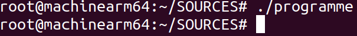
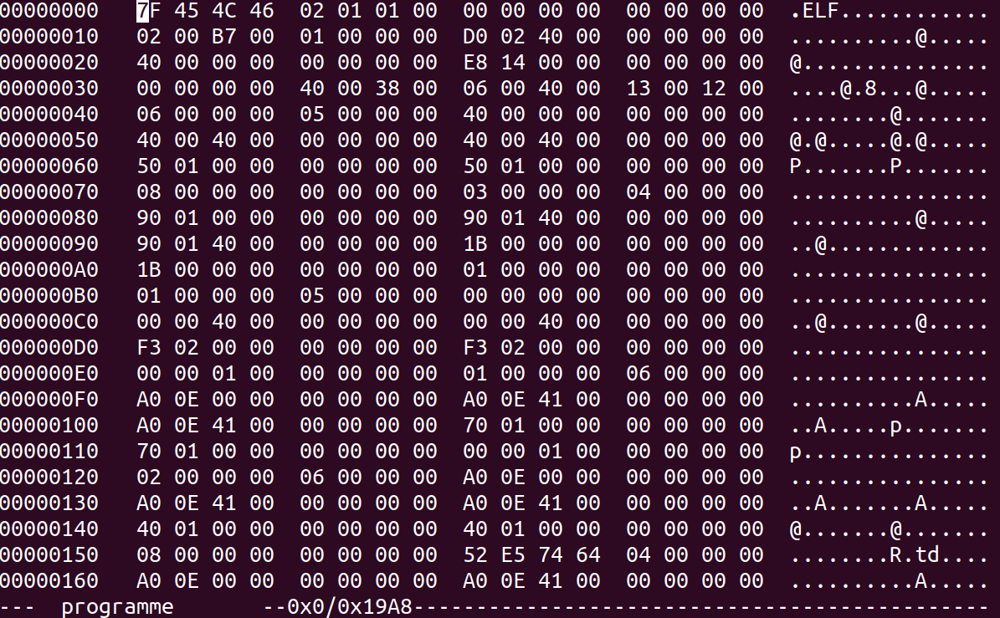
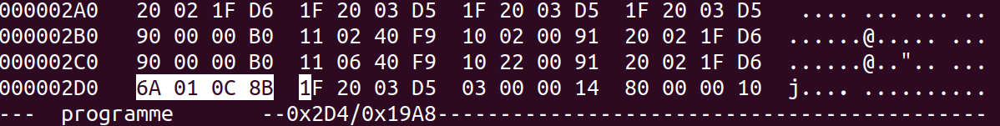
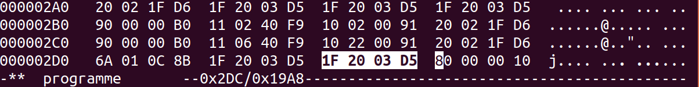
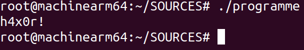

# Désassemblage

Rappelons que l'assemblage de code source mène à du code machine. Comme mentionné en classe (H24), il est possible de désassembler le
code machine afin de retrouver le code original en langage assemblage. Voyons un exemple simple de manipulation du code machine.

## Code machine d'une instruction

Considérons l'instruction ```add x10, x11, x12```.  Selon les notes de cours, la spécification de l'architecture ARMv8 nous indique que
cette instruction se traduit vers ce code machine:

```
1 0 0 01011 00 0 01100 000000 01011 01010
                 ^^^^^        ^^^^^ ^^^^^
                  x12          x11   x10
```

Convertissons ce code machine binaire en hexadécimal:

```
1000 1011  0000 1100  0000 0001  0110 1010
 8    B     0    C     0    1     6    A
```

Au format petit-boutiste, le code machine de l'instruction s'écrit donc ```6A 01 0C 8B```.

## Un programme jouet

Considérons ce programme jouet:

```c
.global main                                                                    
                                                                                
main:                                                                           
        add     x10, x11, x12                 
        nop
        b       fin
        adr     x0, msg
        bl      printf
fin:
        mov     x0, 0
        bl      exit

.section ".rodata"
msg:    .asciz  "h4x0r!\n"                                                      
```

Lorsqu'on exécute ce programme, celui-ci ne fait rien et se termine, puisque ```b fin``` saute par-dessus le code d'affichage:



## Compilation du programme

En compilant le programme, on obtient un exécutable qui contient le code machine. Nous pouvons inspecter son contenu plutôt
cryptique pour un humain. Par exemple, sur Ubuntu, la commande ```hexedit programme``` affiche ceci:



En cherchant dans ce fouillis, on retrouve ```6A 01 0C 8B``` qui est le code machine de ```add x10, x11, x12```:



Cela signifie que ```1F 20 03 D5``` est le code machine de ```nop```, et que ```03 00 00 14``` est le code
machine de ```b fin```. Remplaçons ```03 00 00 14``` par ```1F 20 03 D5``` et sauvegardons le fichier:



Exécutons maintenant l'exécutable ```./programme``` (sans recompiler son code source). Il affiche maintenant
un message!



## Explication

En effet, en écrasant le code machine de ```b fin``` par celui de ```nop```, on obtient un exécutable
identique à celui qu'on obtiendrait en compilant ce code source:

```c
.global main                                                                    
                                                                                
main:                                                                           
        add     x10, x11, x12                 
        nop
        nop                   // <------
        adr     x0, msg
        bl      printf
fin:
        mov     x0, 0
        bl      exit

.section ".rodata"
msg:    .asciz  "h4x0r!\n"                                                      
```

Notons qu'il existe des logiciels plus sophistiqués qui permettent de naviguer plus facilement dans le
code machine en identifiant les instructions associées.
