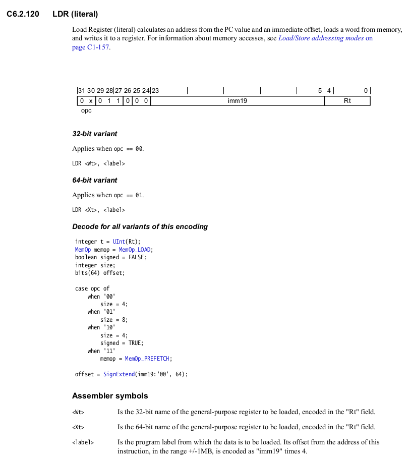

# Chargement et alignement

Une personne a obtenu une erreur en apparence étrange lors de la réalisation du labo 3:

```
relocation truncated to fit: R_AARCH64_LD_PREL_LO19 against `.bss'

warning: One possible cause of this error is that the symbol is being referenced in the
indicated code as if it had a larger alignment than was declared where it was defined.
```

J'ai réussi à corriger l'erreur en laboratoire, mais sans réellement la comprendre.
Il s'avère qu'elle est (à mon avis) plutôt subtile. Ce billet explique l'erreur
et présente des solutions pour la corriger.

## Le problème

Voici un exemple minimal qui reproduit l'erreur:

```asm
.global main

main:
    ldr     x19, bar

    mov     x0, 0
    bl      exit

.section ".bss"
foo:        .skip   1
bar:        .skip   8
```

Ce code déclare deux données dans la mémoire principale: ```foo``` qui
contient un seul octet, et ```bar``` qui en contient huit. Le programme
devrait charger le contenu de ```bar``` dans ```x19```,
puis se terminer. Toutefois, le code ne compile pas; l'assembleur lance
l'erreur décrite plus tôt.

Cette variation du code, en apparence équivalente, est fonctionnelle:

```asm
.global main

main:
    ldr     x19, bar

    mov     x0, 0
    bl      exit

.section ".bss"
bar:        .skip   8     //  Ordre inverse 
foo:        .skip   1     //        des déclarations
```

C'est de cette façon que j'ai corrigé l'erreur en laboratoire...
mais pourquoi est-ce que ça fonctionne?

# Alignement mémoire

La ligne problématique est ```ldr     x19, bar```. Si on la retire,
le code compile. Cette ligne utilise l'instruction ```ldr``` avec
le mode d'adressage appelé «littéral» dans la documentation d'ARMv8,
c'est-à-dire où l'adresse est spécifiée par une étiquette. Voici
l'extrait que je vais décortiquer:



La portion importante est celle-ci:

```
<label> Is the program label from which the data is to be loaded. Its offset from the address of this
        instruction, in the range +/-1MB, is encoded as "imm19" times 4.
```

Elle indique que dans ```ldr     x19, bar```, l'étiquette ```bar``` est subtituée
par un nombre _x_ de 19 bits tel que _4x_ est la distance entre la ligne
de code et la donnée ```bar```. Afin que ce soit plus concret, considérons la
deuxième version du code (celle qui compile). Rappelons que le code machine d'une instruction sous ARMv8
est stocké sur 4 octets. Ainsi, chaque ligne se situe à cette distance (en nombre
d'octets) de ```ldr     x19, bar```:

```asm
.global main

main:
    ldr     x19, bar      // distance: 0

    mov     x0, 0         // distance: 4
    bl      exit          // distance: 8

.section ".bss"
bar:        .skip   8     // distance: 12
foo:        .skip   1     // distance: 20 
```

Comme ```bar``` se situe à une distance de _12 = 4·3_, le nombre _x_ vaut _3_.
Lors de l'exécution de ```ldr     x19, bar```, le processeur extrait le nombre _3_
du code machine, le multiplie par _4_ afin d'obtenir _12_, et charge le double-mot
situé _12_ octets plus loin en mémoire (donc le contenu de ```bar```).

Reconsidérons la première version du code (celle qui ne compile pas):

```asm
.global main

main:
    ldr     x19, bar      // distance: 0

    mov     x0, 0         // distance: 4
    bl      exit          // distance: 8

.section ".bss"
foo:        .skip   1     // distance: 12
bar:        .skip   8     // distance: 13
```

Remarquons que ```bar``` se situe maintenant à une distance de _13_ octets en mémoire.
Or, _13_ n'est pas un multiple de _4_, donc ce mode d'adressage ne peut pas être utilisé!
L'assembleur tente tant bien que mal de nous en avertir en évoquant
un enjeu de «taille d'alignement»:

```
relocation truncated to fit: R_AARCH64_LD_PREL_LO19 against `.bss'

warning: One possible cause of this error is that the symbol is being referenced in the
indicated code as if it had a larger alignment than was declared where it was defined.
```

## Solutions

Nous avons déjà vu une façon de corriger l'erreur: inverser les deux
déclarations. Il existe d'autres approches moins artisanales.

### Approche A: aligner ```bar```

Comme le problème est que la donnée ```bar``` se situe à une distance qui n'est pas un 
multiple de _4_, on peut simplement aligner explicitement son adresse à un
tel multiple:

```asm
.global main

main:
    ldr     x19, bar      // distance: 0

    mov     x0, 0         // distance: 4
    bl      exit          // distance: 8

.section ".bss"
foo:        .skip   1     // distance: 12
            .align  4
bar:        .skip   8     // distance: 16

```

### Approche B: utiliser ```adr```

Alternativement, on peut stocker l'adresse numérique associée à ```bar```
dans un registre, puis utiliser le mode d'adressage indirect par registre:

```asm
.global main

main:
    adr     x20, bar
    ldr     x19, [x20]

    mov     x0, 0
    bl      exit

.section ".bss"
foo:        .skip   1
bar:        .skip   8
```
