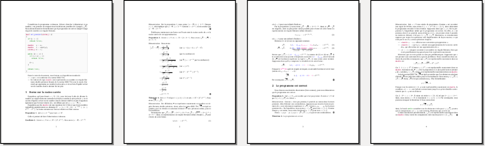

# Comparaisons à l'aide de nombres en virgule flottante

Suite au devoir 2 de la session H24, plusieurs questions ont surgi sur des comparaisons effectuées à l'aide
de nombres en virgule flottante. Bien qu'ils ne soient introduits que vers la fin de la session, voyons pourquoi il est
risqué de les utiliser.

## Test de primalité avec divisions successives jusqu'à √n

Il est bien connu que cet algorithme détermine correctement si un nombre _n_ est premier:

```
  si n ≤ 1: retourner faux
  sinon:
     d ← 2

     tant que d ≤ √n:
       si d divise n:
         retourner faux

       d ← d + 1

    retourner vrai
```

Or, il est risqué d'implémenter cet algorithme à l'aide de nombres en virgule flottante puisque ceux-ci
approximent les vraies valeurs. Par exemple, considérons ce code:

```c++
 uint64_t x = 9223372036809340154;
 double   y = x;
```

La valeur de ```y``` n'est pas la même que celle de ```x```. En fait, ```y``` est ***inférieure*** à ```x```:

```
x = 9223372036809340154
y = 9223372036809339904
```

Ainsi, le calcul de la racine carrée de ```x``` risque d'être suffisamment erroné pour que le programme
échoue. Toutefois, ce n'est pas le cas, les erreurs sont suffisamment petites pour qu'une telle
implémentation soit correcte! Pour les personnes (trop) curieuses (pour leur propre bien),
voici une preuve que j'ai pondue qui dépasse largement le cadre du cours:

[](./preuve.pdf)

## Tester si n est divisible par d

Supposons maintenant que l'on désire tester si un entier non signé _n_ est divisible par un entier non signé _d_ (où _2 ≤ d < n_).

### Test via les entiers

Dans un langage comme C++, il suffit de tester ```n % d == 0```. Or, rappelons que dans le langage d'assemblage de l'architecture ARMv8,
il n'y a pas de modulo. Ainsi, nous pouvons plutôt combiner une division entière et une multiplication:

```c++
bool est_divisible_A(uint64_t n, uint64_t d)
{
  return (n == ((n / d) * d));
}
```
ce qui se traduit environ comme suit en langage d'assemblage:
```c
        udiv    x21, x19, x20
        mul     x21, x21, x20
        cmp     x19, x21
```

### Test via les nombres en virgule flottante

Il a été proposé de plutôt passer par les nombres en virgule flottante. Par exemple, si _n = 23_ et _d = 5_,
alors on calcule _23 ÷ 5 = 4_ et _23 / 5 = 4.6_, et, puisque _4 ≠ 4.6_, on en conclue que _23_ n'est pas
divisible par _5_ (ce qui est correct). En général, la procédure s'implémente comme suit:

```c++
bool est_divisible_B(uint64_t n, uint64_t d)
{
  uint64_t k = n / d;
  double   x = ((double)n) / ((double)d);

  return (k == x);
}
```

Comme annoncé en classe, cette approche ne fonctionne pas! Par exemple, ```est_divisible_B(9007199254740995, 5)```
retourne ```false``` alors que 9007199254740995 est clairement divisible par 5.

### Temps d'exécution des deux approches

Bien que la deuxième approche ne fonctionne pas, on m'a demandé si elle était plus rapide. Il est impossible
de donner une réponse absolue puisque le temps d'exécution dépend de l'implémentation matérielle de
l'unité arithmétique et logique ainsi que de l'unité de calcul en virgule flottante du processeur sur
lequel le code est exécuté. Néanmoins, il est possible de tester empiriquement les deux approches sur la
machine virtuelle utilisée dans le cours. Pour y arriver, j'ai choisi de tester si plusieurs nombres sont
divisibles par 5, et de répéter l'expérience 1000 fois:

```
  répéter 1000 fois:
    pour n de 2 à 1048576: // constante choisie arbitrairement (c'est une puissance de 2 près d'un million)
      tester si n est divisible par 5
```

Sur ma machine, le premier test (qui utilise seulement les entiers) termine en 30.570 secondes, alors que le second
test (qui utilise les nombres en virgule flottante) termine en 2 minutes 42.290 secondes! Notons que ces résultats
sont à prendre avec un grain de sel comme il s'agit d'une machine virtuelle (et non matérielle).
Voici les deux implémentations utilisées:

```c
// Approche A ////////////////////
.global main                    //
                                //
main:                           // int main()
        mov     x28, 5          // {
        mov     x27, 1048576    //
                                //   uint64_t n;
        mov     x19, 1000       //   uint64_t i = 1000;
repeter_test:                   //
        cbz     x19, fin        //   while (i != 0) {
        mov     x20, 2          //     n = 2;
boucle:                         //
        cmp     x20, x27        //     while (n != 1048576) {
        b.eq    prochain_test   //
                                // 
        udiv    x21, x20, x28   // 
        mul     x21, x21, x28   // 
        cmp     x20, x21        //       n == ((n / 5) * 5);
                                //
        add     x20, x20, 1     //       n++;
        b       boucle          //     }
prochain_test:                  //
        sub     x19, x19, 1     //     i--;
        b       repeter_test    //   }
fin:                            //
        mov     x0, 0           // 
        bl      exit            // }
```
```c
// Approche B ////////////////////
.global main                    //
                                //
main:                           // int main()
        mov     x28, 5          // {
        fmov    d15, 5.0        //
        mov     x27, 1048576    //
                                //   uint64_t n;
        mov     x19, 1000       //   uint64_t i = 1000;
repeter_test:                   //
        cbz     x19, fin        //   while (i != 0) {
        mov     x20, 2          //     n = 2;
boucle:                         //
        cmp     x20, x27        //     while (n != 1048576) {
        b.eq    prochain_test   //
                                // 
        udiv    x21, x20, x28   //
        ucvtf   d8, x21         //
        ucvtf   d9, x20         //
        fdiv    d9, d9, d15     //
        fcmp    d8, d9          //       ((double)(n / 5)) == (((double)n) / 5.0);
                                //      
        add     x20, x20, 1     //       n++;
        b       boucle          //     }
prochain_test:                  //
        sub     x19, x19, 1     //     i--;
        b       repeter_test    //   }
fin:                            //
        mov     x0, 0           // 
        bl      exit            // }
```
